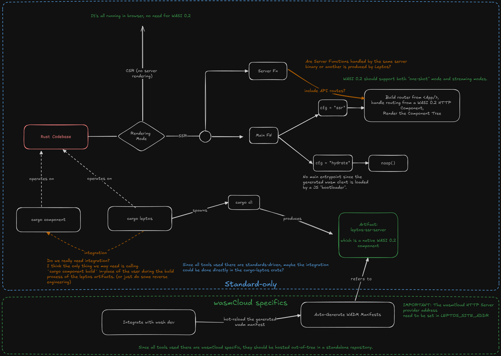

# Initial Study

> This is WIP indeed.

## Server Compilation

The basic idea is that `cargo leptos` is responsible for calling `cargo` to
produce:

* The CSR target that will be loaded by a JS script in the browser,
* The SSR target that we want to compile to `wasm-wasip2` component.

We will write some integration code to handle the HTTP Server
logic using [`wasi:http`][wasi-http-handler].

This is already done by Leptos for different HTTP framework,
[see here][leptos-integrations].

Of course, things are not so easy!
We need to be make sure most of the server logic can be compiled down to
`wasm-wasip2` and implement fallback code to replace features that cannot be
compiled.

At this point, we should check if those can be compiled to our target:

* Routers,
* HTML Element Rendering,
* Server Functions (this is dependent on the actual code written by users ofc).

We need to hook into the [`server_fn` crate][srv_fn_crate] to add adapters
to [`wasi:http`][wasi-http-handler].

If we can get to there, we can already call it a big win! :tada:

**BUT**! the user will likely want to use a custom [`world`][wit-world] to leverage
the whole ecosystem. For example, maybe the user want to use
the new wasmcloud's [Couchbase Integration][wasmcloud-couchbase] to do some
NoSQL manipulation in the context of a Server Function. This means,
the leptos `cargo` plugin needs to allow the user to customise the world
and generate bindings accordingly.

[wit-world]: https://component-model.bytecodealliance.org/design/worlds.html
[wasmcloud-couchbase]: https://github.com/couchbaselabs/wasmcloud-provider-couchbase/tree/main/wit/couchbase
[srv_fn_crate]: https://github.com/leptos-rs/leptos/tree/main/server_fn

## wasmCloud integration

Once we managed to get Leptos to output our backend as a component,
we just have to integrate the produced artifact to the wasmCloud ecosystem.

We can imagine a CLI tool that will generate a wadm manifest for our backend and
optionally optimise it to work with `wash dev` allowing for a fast dev-loop
when building your *full-stack* :tm: app with wasmCloud :sunglasses:

[wasi-http-handler]: https://github.com/WebAssembly/wasi-http/blob/main/wit/handler.wit#L4
[leptos-integrations]: https://github.com/leptos-rs/leptos/tree/main/integrations

## Is Nightly Rust needed?

As of Rust 1.82.0, IIUC, the two unstable features we may be interested in are:
* `wasi_ext`: Some extensions to `std::fs` and `std::net`, but seems to be only
  *nice-to-have*.
* the cargo feature [`build-std`](https://github.com/rust-lang/cargo/blob/rust-1.82.0/src/cargo/core/features.rs#L1253),
  to rebuild the stdlib with optimisation of the WebAssembly target. While it's more
  of a *nice-to-have* for the `ssr`, it's kind of important for production build
  of the `csr` as explained in [Leptos Docs][leptos-wasm-size].

[leptos-wasm-size]: https://book.leptos.dev/deployment/binary_size.html
